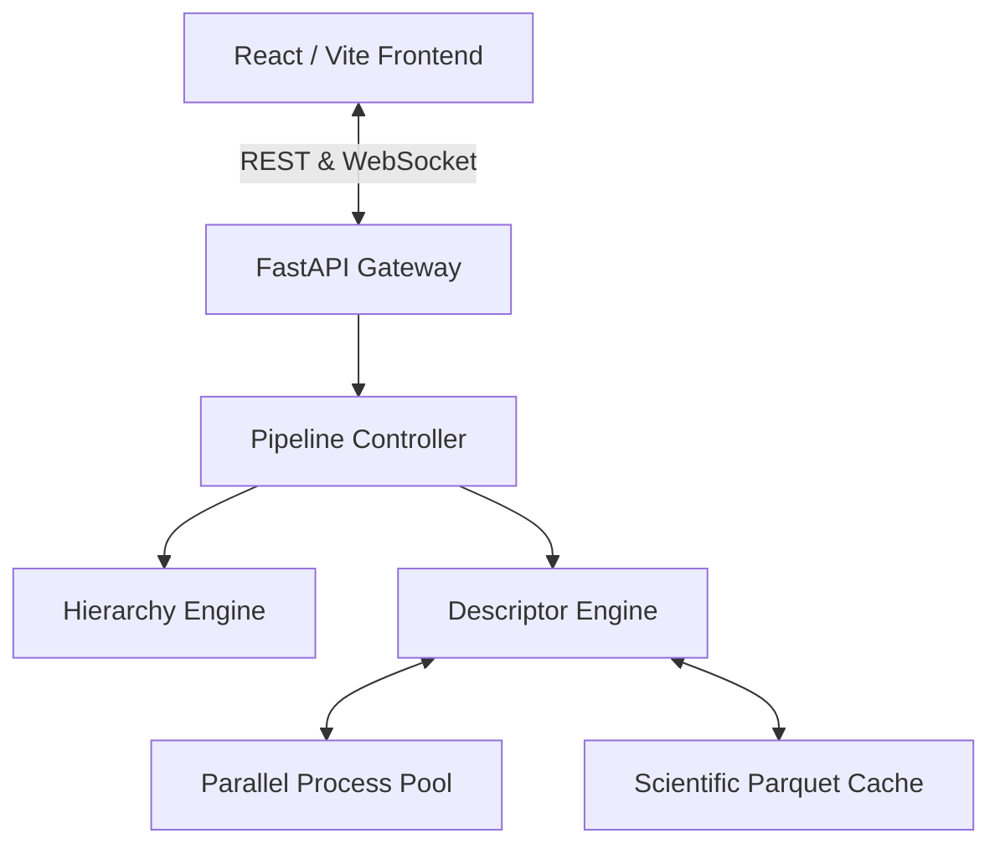

# Scientific Data Orchestrator (SDO)


The **Scientific Data Orchestrator (SDO)** is a premium, open-source computational toxicology framework and data engineering platform. Designed for researchers, toxicologists, and academic labs, SDO automates the complex pipelines of chemical data curation, descriptor enrichment, hierarchical dataset segregation, and AI readiness analysis.

## 🧬 Scientific Purpose

SDO bridges the gap between raw chemical assay data and machine learning-ready datasets. It handles:
- **Automated Curation**: Maps messy CSV/Excel columns into canonical scientific variables.
- **Hierarchical Segregation**: Splits massive heterogeneous datasets into homogenous toxicity endpoints using a recursive dataframe branching engine.
- **Molecular Descriptor Enrichment**: Computes RDKit & Mordred molecular descriptors (up to 2D/3D features) across parallel multiprocessing pools.
- **AI Readiness**: Evaluates datasets for predictive modeling suitability, highlighting class imbalances and feature sparsity.

---

## 🚀 Features

- **Blazing Fast Pipeline**: Built on Python/FastAPI using `concurrent.futures` and `Parquet` caching for zero-copy memory operations.
- **Real-Time Telemetry**: WebSocket-driven frontend (React + Vite) providing sub-second updates on enrichment ETAs and processing rates.
- **Memory Guard Shield**: Protects the host server from Out-Of-Memory crashes during giant RDKit matrix allocations.
- **Interactive UI**: A stunning, dark-mode scientific workspace built with TailwindCSS, Lucide icons, and Plotly.js.

---

## 🏛️ Architecture



---

## ⚙️ Deployment & Installation

### Local Development Setup

1. **Clone the Repository**
   ```bash
   git clone https://github.com/your-org/scientific-data-orchestrator.git
   cd scientific-data-orchestrator
   ```

2. **Configure Environment**
   Copy the `.env.example` files to `.env` in the root, `backend/`, and `frontend/` directories.
   ```bash
   cp .env.example .env
   cp backend/.env.example backend/.env
   cp frontend/.env.example frontend/.env
   ```

3. **Docker Compose (Recommended)**
   Spin up the entire stack using Docker:
   ```bash
   docker-compose up --build
   ```
   The UI will be available at `http://localhost`, and the API at `http://localhost:8000`.

### Manual Backend Setup
```bash
cd backend
python -m venv venv
source venv/bin/activate  # On Windows: venv\Scripts\activate
pip install -r requirements.txt
uvicorn main:app --reload --port 8000
```

### Manual Frontend Setup
```bash
cd frontend
npm ci
npm run dev
```

---

## 🛡️ License & Academic Use

This project is licensed under the **PolyForm Noncommercial License 1.0.0**.
- ✅ **Permitted**: Academic research, educational use, personal projects, and non-profit open-source contributions.
- ❌ **Prohibited**: Commercial SaaS offerings, rebranding for profit, and internal corporate use for revenue generation.

For commercial licensing inquiries, please contact the maintainers.

## 🤝 Contribution Guidelines

We welcome academic and open-source contributions! Please read our [CONTRIBUTING.md](CONTRIBUTING.md) and [CODE_OF_CONDUCT.md](CODE_OF_CONDUCT.md) before submitting pull requests.

## 📚 Citation

If you use SDO in your research, please cite:
```bibtex
@software{SDO_2026,
  author = {SDO Project Team},
  title = {Scientific Data Orchestrator: A Computational Toxicology Framework},
  year = {2026},
  url = {https://github.com/your-org/scientific-data-orchestrator}
}
```
